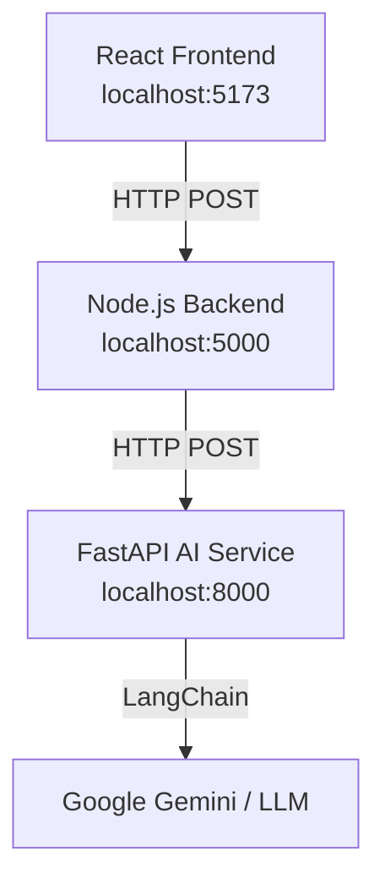

# AI Guide Application

A full-stack application with a React frontend, Node.js backend, and a Python AI microservice.

## Architecture



### Folder Structure
- `frontend/` - React frontend powered by Vite and Tailwind CSS.
- `server/` - Node.js Express backend acting as the main API and proxy to the AI service.
- `ai-service/` - Python FastAPI microservice handling LLM interactions via LangChain.

## Prerequisites
- Node.js (v18+)
- Python (3.10+)
- MongoDB running locally or on Atlas

## Environment Variables
Before running the services, you need to configure the environment variables for each component:

### 1. Python AI Service (`ai-service/.env`)
Create `ai-service/.env` based on `ai-service/.env.example`:
```env
GOOGLE_API_KEY=your_google_gemini_api_key_here
```
*How to get the key:* Get a Google Gemini API key from [Google AI Studio](https://aistudio.google.com/).

### 2. Node.js Backend (`server/.env`)
Ensure your `server/.env` file contains the following (create one if it doesn't exist):
```env
PORT=5000
MONGO_URI=mongodb://127.0.0.1:27017/ai-guide
AI_SERVICE_URL=http://localhost:8000
```

## How to Start the Services

You will need three terminal windows to run the entire stack.

### 1. Start the React Frontend
```bash
cd frontend
npm install
npm run dev
```

### 2. Start the Node.js Backend
```bash
cd server
npm install
npm run dev
```

### 3. Start the Python AI Service
```bash
cd ai-service
python -m venv venv
venv\Scripts\activate
pip install -r requirements.txt
uvicorn main:app --reload --port 8000
```

## API Endpoints

### Python AI Service
- `GET http://localhost:8000/` - Health check endpoint. Returns `{"message": "AI Service Running"}`
- `POST http://localhost:8000/ai/chat` - LLM interaction endpoint.
  - **Request:** `{"message": "Hello"}`
  - **Response:** `{"response": "Hi there! How can I help?"}`

### Node.js Proxy Endpoint
- `POST http://localhost:5000/api/ai/chat` - Proxy to the Python service. Called by the React frontend.

## Troubleshooting
- **CORS Error:** Make sure both the Python and Node.js servers are running on the expected ports. The frontend expects Node on port `5000`. The Python service allows CORS requests from `http://localhost:5000` and `http://localhost:5173`.
- **"Failed to get response" in Chat:** Check the terminal where your Python service is running. If you haven't set a valid `GOOGLE_API_KEY`, the LangChain call will fail and return a 500 error.
- **Connection Refused in Node.js:** Ensure the Python service is running on `http://localhost:8000`. If you changed the Python port, update `AI_SERVICE_URL` in `server/.env`.
